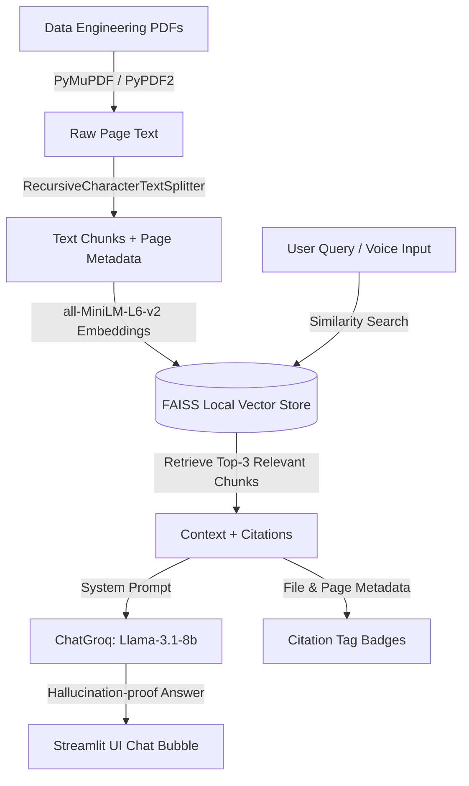

# 🤖 Data Engineering Q&A Bot

A complete, production-quality, and visually stunning AI-powered **Retrieval-Augmented Generation (RAG)** chatbot built with Python and Streamlit. This application answers questions **strictly** from provided Data Engineering PDF textbooks, eliminating hallucinations and delivering exact source citations (PDF filename + page number) for every statement.

---

## 🛠️ Tech Stack & Architecture

This application employs a modern, offline-first embeddings pipeline combined with high-speed LLM inference:

- **Frontend Interface:** [Streamlit](https://streamlit.io/) with a customized, glowing dark/glassmorphic premium UI.
- **Voice Recognition:** Web Speech API (`webkitSpeechRecognition`) integrated seamlessly into Streamlit via an iframe-to-parent DOM bridge.
- **RAG Orchestration:** [LangChain](https://www.langchain.com/) (LangChain Community, LangChain Groq, and LangChain HuggingFace).
- **Primary PDF Parser:** [PyMuPDF](https://pymupdf.readthedocs.io/en/latest/) (Fitz) for rapid, page-level, high-fidelity text extraction.
- **Fallback PDF Parser:** [PyPDF2](https://pypdf-2.readthedocs.io/en/latest/) for robustness.
- **Text Chunking:** `RecursiveCharacterTextSplitter` (configured with `chunk_size = 1500` and `chunk_overlap = 300`).
- **Embedding Model:** Local `sentence-transformers/all-MiniLM-L6-v2` loaded locally via `HuggingFaceEmbeddings` (runs entirely on CPU—no API key required).
- **Vector Database:** [FAISS](https://github.com/facebookresearch/faiss) (local vector database indexing).
- **LLM Reasoning Engine:** [Groq Cloud API](https://console.groq.com/) using the highly efficient `llama-3.1-8b-instant` model running with deterministic parameters (`temperature = 0.0`).

### RAG Pipeline Flow



---

## 📁 Folder Structure

The project has been structured cleanly and modularly following production-grade software guidelines:

```
c:\Users\srila\Desktop\proj/
│
├── app.py                     # Main Streamlit Application Entrypoint
├── .env                       # Environment variables (Groq API Key - Local gitignored)
├── .env.example               # Example template for environment variables
├── requirements.txt           # Python dependency specifications
├── README.md                  # Project Documentation
│
├── data/
│   └── pdfs/                  # INPUT: Place Data Engineering textbooks (PDFs) here
│
├── vectorstore/               # STORAGE: FAISS index is built and saved here
│
├── components/
│   └── voice_input.py         # Speach-To-Text browser component using Web Speech API
│
└── src/
    ├── pdf_processor.py       # Custom fast PDF parsers (PyMuPDF & PyPDF2)
    ├── chunker.py             # Splitting pages with overlap and metadata retention
    ├── embeddings.py          # sentence-transformers cache initialization
    ├── vector_store.py        # Loading and saving local FAISS indices
    ├── prompts.py             # Strict, rigorous prompt enforcing citations
    └── rag_chain.py           # Top-K retrieval, API backoff, and Groq integration
```

---

## ⚙️ Ingestion & Chunking Logic

To ensure the bot never fabricates information (hallucinates) and always cites pages correctly, the following logic is embedded in the pipeline:
1. **PDF Ingestion:** PDFs inside `data/pdfs/` are loaded page-by-page. Each page creates a standalone LangChain `Document` containing its text and metadata (`source: <filename>`, `page: <page_number>`).
2. **Recursive Splitting:** The chunker splits documents. If a page's text spans across multiple chunks, the chunker replicates the exact `source` and `page` metadata on all child chunks.
3. **Context Presentation:** When a user queries the bot, the top 3 chunks are retrieved. They are formatted with boundary tags (e.g. `[Chunk #1] Source: book.pdf, Page: 22 ...`) and fed directly into the system prompt.
4. **Strict Grounding:** The prompt dictates that if the retrieved context does not contain the answer, the LLM must respond with the fallback: *"I could not find this in the provided textbooks."*

---

## 🚀 Setup & Installation

### 1. Prerequisites
- **Python 3.13+** installed on your system.
- A **Groq API Key** (Get a free key from the [Groq Console](https://console.groq.com/)).

### 2. Installation Steps
1. Navigate to the project directory:
   ```bash
   cd "c:\Users\srila\Desktop\proj"
   ```
2. Install the required Python packages:
   ```bash
   pip install -r requirements.txt
   ```

### 3. API & Credentials Setup
1. Copy the environment template:
   ```bash
   cp .env.example .env
   ```
2. Open the `.env` file and replace `your_groq_api_key_here` with your actual Groq API Key:
   ```env
   GROQ_API_KEY=gsk_...
   ```
   *(Note: You can also enter the API key directly in the Streamlit Sidebar during execution if you prefer not to write it to disk).*

### 4. Adding Textbooks
Put your Data Engineering PDF textbooks inside the `data/pdfs/` folder. For example:
- `data/pdfs/Designing_Data_Intensive_Applications.pdf`
- `data/pdfs/Fundamentals_of_Data_Engineering.pdf`

---

## 🏃 Running the Application

To launch the Streamlit server:
```bash
streamlit run app.py
```

Streamlit will boot up local and network URLs. By default, open your browser and navigate to:
```
http://localhost:8501
```

### Initial Run & Indexing
- The first time the application loads, it will detect the PDF files in `data/pdfs/`.
- It will automatically kick off the local parsing and embedding pipeline.
- The generated FAISS database index is saved to `vectorstore/`.
- Subsequent runs will load this database **instantly** (under 1 second) rather than re-processing!
- If you add or delete PDFs in `data/pdfs/`, simply click **"🔄 Ingest & Rebuild Vector Index"** in the sidebar.

---

## 🎙️ Using Voice Input
- Ensure you are running the app in a browser that supports the Web Speech API (Chrome, Edge, or Safari).
- Click the glowing circular **Microphone Button** floating near the bottom of the page.
- Grant microphone access in your browser when prompted.
- Start speaking! The status text will display `Listening... Speak now`.
- Once you stop speaking, the Web Speech API transcribes your speech locally in milliseconds, auto-fills it directly into the Streamlit Chat Input, and focuses the chat field so you can hit `Enter` to submit.

---

## 📸 Screenshots Section

Once running, you will be presented with a premium-tier user interface:

1. **Dashboard Controls (Sidebar):** Verify vector status, review parsed filenames, rebuild the index, and secure your Groq API Key.
2. **Interactive Chat:** See user queries and bot responses mapped beautifully as chat bubbles.
3. **Explicit Badges:** Hover or click on the sky-blue pills under each AI message to see exactly which textbook and page number supplied the response.

---

## 🛑 Error & Exception Handling
- **Missing API Key:** If no API key is set, the chat input remains active, but submission displays a clear instructions badge prompting the user to supply the key.
- **Groq 429 Rate Limits:** Groq has generous free-tier limits, but rapid successive queries can cause 429 errors. `src/rag_chain.py` includes a retry decorator using **Exponential Backoff** that retries the request up to 3 times with progressive delays. If it still fails, it shows a clean notification card without crashing the app.
- **Invalid API Key:** If an invalid key is supplied, a custom prompt warning appears in red in place of the message.
- **Pickle Deserialization:** Incorporates safe loading using `allow_dangerous_deserialization=True` within the FAISS loader to allow seamless operations on Windows systems.
